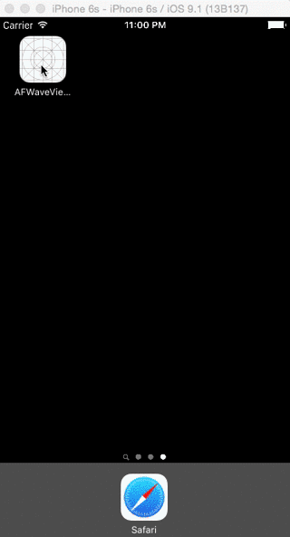

# AFWaveView

Animation with heart shape witch can wave (use René Descartes line)

心形波浪图像，笛卡尔曲线



# To ues：

1.import AFWaveView.h and AFWaveView.m 

  (导入头文件)

2.written these code in "touchesBegan" 

  (在touchesBegan中写入下面的代码)

```
UITouch *t = touches.anyObject;
CGPoint p  = [t locationInView:self.view];
AFWaveView *waveView = [[AFWaveView alloc]initWithPoint:p];
[self.view addSubview:waveView];
```
3.optional

  (可选项)
```
waveView.maxR=50;      //radius of the heart
waveView.duration=2;   //the duration of the heart show
waveView.waveDelta=10; //the delta between wave to wave
waveView.waveCount=3;  //the count of wave
                       //read more? Clone it :)
```
